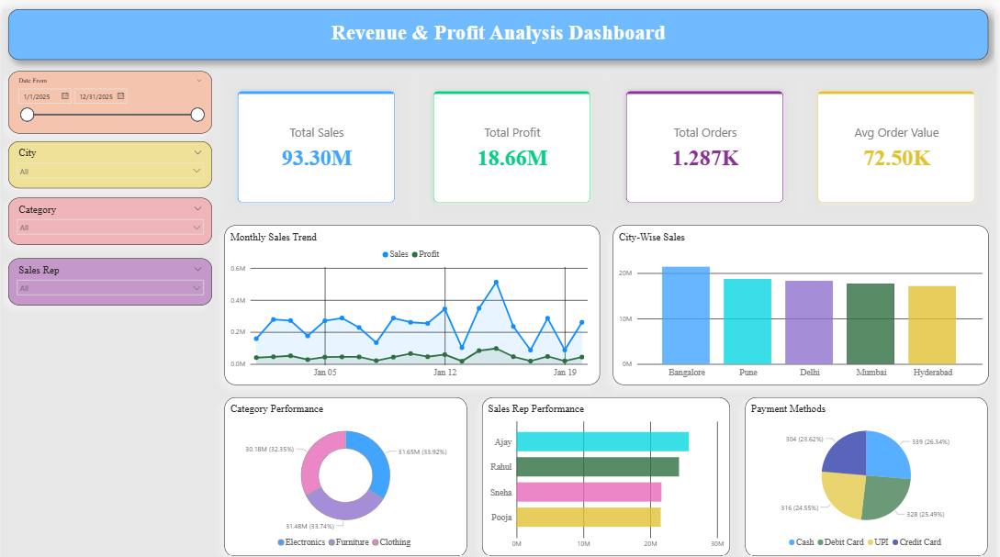
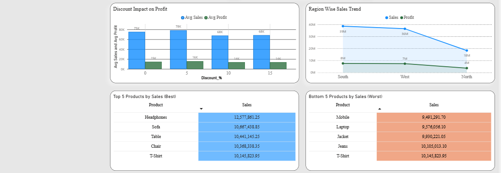

# Revenue & Profit Analysis Dashboard (Power BI)
## Project Overview
This Power BI dashboard provides a complete analysis of sales, profit, orders, products, regions, and customer payment behavior.
The dashboard helps business stakeholders monitor performance, identify profitable categories, evaluate sales representatives, and make data-driven decisions.
---
## Dashboard Features
### KPI Metrics
- Total Sales
- Total Profit
- Total Orders
- Average Order Value
### Visualizations
- Monthly Sales Trend
- City-Wise Sales Analysis
- Category Performance
- Sales Representative Performance
- Payment Method Distribution
- Discount Impact on Profit
- Region-Wise Sales Trend
- Top 5 Products by Sales
- Bottom 5 Products by Sales
---
## Tools Used
- Power BI
- Microsoft Excel
- Power Query
- DAX
---
## Dashboard Screenshots
## Dashboard Overview

## Product & Region Analysis

---
## Business Insights
- Sales exceeded 93M.
- Profit reached 18.66M.
- Bangalore generated the highest sales.
- Electronics category contributed the largest revenue share.
- Cash and Debit Card were the most used payment methods.
- Discount levels impacted profit margins significantly.
---
## Files Included
| File | Description |
|--------|-------------|
| Revenue_Profit_Analysis.pbix | Power BI Dashboard |
| Sales_Data.xlsx | Dataset |
| Dashboard_Overview_1.png | Dashboard Screenshot |
| Dashboard_Overview_2.png | Dashboard Screenshot |

---
## Author
Anwar Shaikh
Data Analyst | SQL | Excel | Power BI | Python
